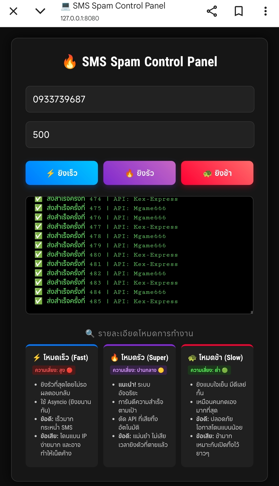

# SMS-Spam ยิง SMS แบบมีเว็บไซต์
# โปรเจคนี้ทำขึ้นฟรี หากใครเอาไปขายพ่อมึงตาย
# โปรเจคนี้มี 113 api
## ⚠️ ข้อควรระวัง

โปรเจกต์นี้จัดทำขึ้นเพื่อ **การศึกษาเรียนรู้** เท่านั้น

**ข้อตกลงการใช้งาน:**
1. ผู้พัฒนาไม่สนับสนุนให้นำไปใช้สร้างความเดือดร้อนหรือก่อกวนผู้อื่น
2. ผู้ใช้งานต้องรับผิดชอบต่อการกระทำของตนเองทุกประการ
3. การส่งข้อความก่อกวนผู้อื่นอาจมีความผิดตาม **พ.ร.บ. คอมพิวเตอร์**
4. ผู้พัฒนาจะไม่รับผิดชอบต่อความเสียหายใดๆ ที่เกิดขึ้นจากการใช้งาน

หากคุณใช้งานโปรแกรมนี้ ถือว่าคุณยอมรับเงื่อนไขดังกล่าวแล้ว

### 🇬🇧 Disclaimer
This tool is for **educational purposes only**. The developer is not responsible for any misuse or damage caused by this program.

## 🖼️ ภาพตัวอย่าง

# 📥 วิธีติดตั้งใน termux
คัดลอกคำสั่งไปวาง แล้วรอติดตั้งสักครู่
```
cd && pkg install git -y && git clone https://github.com/ninjamadeena/SMS-Spam.git && cd SMS-Spam && bash install-termux.sh && cd
```
## รันใช้
```
RUN-SMS-WEB
```
### แล้วเข้า http://127.0.0.1:8080 ต้องรัน RUN-SMS-WEB ก่อนเท่านั้นถึงจะเข้าได้❗
## ลิ้งค์โหลด Termux
https://f-droid.org/repo/com.termux_1002.apk
